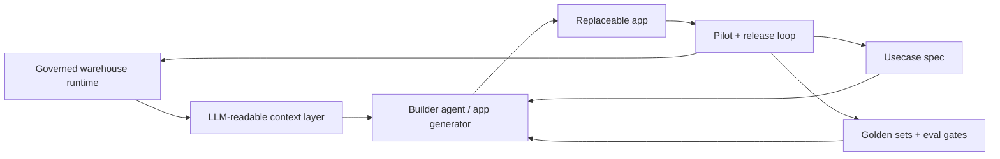
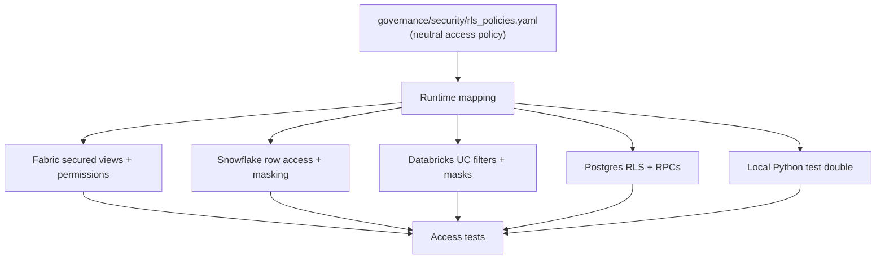
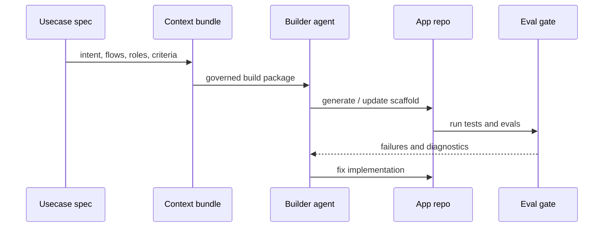
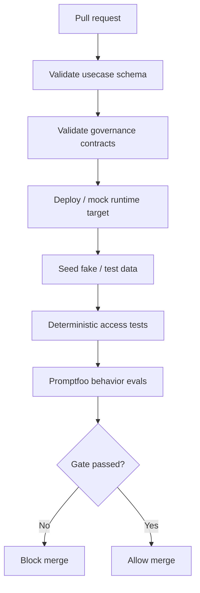

# Production factory model

**Status:** Draft &middot; **Version:** 0.2.0 &middot; **Owner:** finance-operations / platform
**Audience:** builder agents (Codex, Claude, and others) and engineers extending the factory
**Applies to:** every use case in this repository

## Purpose

The durable asset of this repository is not the app, the model, the database,
or the eval tool. It is the versioned set of **contracts** &mdash; access policy,
data and semantic contracts, use case specs, golden sets, and eval gates &mdash;
that lets new AI apps be generated, tested, piloted, replaced, and released
without losing governance or domain knowledge.

Apps are generated against those contracts and are expected to be regenerated or
thrown away. The contracts are not. Two rules follow from this and hold
everywhere in the factory:

- The production security boundary is the **governed warehouse runtime**, never
  the app and never the prompt.
- Postgres/Supabase is a **local and development harness**, never the default
  production governance layer.

## How this document maps to the repo today

This document describes the target factory. The repository currently implements
a local mock of it. The table below maps each concept to its artifact and
whether it exists today. Anything marked **planned** is a target, not a current
capability &mdash; do not reference planned artifacts as if they exist.

| Concept | Artifact in this repo | Status |
|---|---|---|
| Governed access policy | `governance/security/rls_policies.yaml` | exists; the local mock reads it as source of truth |
| Data contract | `governance/data_contracts/invoice_lines.schema.yaml` | exists |
| Semantic layer | `governance/semantic_layer/invoice_lines.semantic.yaml` | exists |
| LLM read-access contract | `governance/access_contracts/llm_read_access.yaml` | exists |
| Domain meaning docs | `governance/meaning_docs/invoice_domain.md` | exists |
| Lineage | `governance/lineage/invoice_lineage.md` | exists |
| Audit event schema | `governance/audit/audit_events.schema.yaml` | exists |
| Use case spec | `usecases/<id>/usecase.spec.{yaml,md}` | exists |
| Release criteria | `usecases/<id>/release_criteria.yaml` | exists |
| Golden sets | `golden_sets/<id>/` | exists (questions, rls, refusal) |
| Eval gate | `evals/run_evals.py`, `evals/eval_config.yaml` | exists; offline gate runs in CI |
| Local app (replaceable) | `apps/mini_invoice_rag/` | exists |
| Per-runtime policy implementations | `governance/runtime_targets/<runtime>.yaml` | planned |
| Use case JSON Schema | `schemas/usecase.schema.json` | planned |
| Promptfoo behavior evals | `evals/promptfoo/<id>.promptfooconfig.yaml` | planned |
| Context-bundle builder | `factory/build_context_bundle.py` | planned |

## Current state: the local mock

What runs today:

- CSV fixtures under `golden_sets/invoice-unpaid-chatbot/fake_data/`.
- A Python implementation of the access policy that **reads
  `rls_policies.yaml`** (roles, allow-rules, and forbidden phrases) rather than
  hardcoding them, in `apps/mini_invoice_rag/src/mini_rag/policies.py`.
- A deterministic Python eval runner (`python evals/run_evals.py --offline`).
- A thin local Ollama adapter for non-deterministic smoke tests.

The mock exists for fast iteration, deterministic evals, builder-agent smoke
tests, and the first version of golden sets and specs. It is never the
production security boundary; it is a test double for the governed access
policy.

## Target architecture



The app is replaceable. The contracts, policies, semantics, golden sets, eval
gates, and pilot learnings are the long-lived assets.

## Principles (non-negotiable)

These hold for every use case and every runtime:

1. The app generator, model provider, UI framework, and eval tool are all
   replaceable.
2. The governed access policy is mandatory and is defined once as a
   vendor-neutral contract.
3. The warehouse/runtime policy implementation is the security boundary.
4. The default decision is **deny**.
5. Rows or columns hidden by policy must never enter retrieval context &mdash; not
   even for summarization.
6. Prompting is not access control. MCP/context exposure is not access control
   unless the underlying data access is already governed.
7. Golden sets are versioned domain truth; never weaken a golden set to make a
   weak app pass.
8. CI/CD eval gates must block regressions.
9. Pilot feedback updates the factory artifacts, not only the app code.

## Runtime targets

The factory supports multiple runtimes without changing the meaning of a use
case. Each runtime implements the same neutral access policy using its own
native controls.

| Runtime | Storage / catalog | Row & column control | Audit | Role in the factory |
|---|---|---|---|---|
| Local mock | CSV fixtures | Python interpreter over the access-policy contract | logged fields | dev + deterministic tests; never a security boundary |
| OneLake + Fabric | Lakehouse / Warehouse tables | secured views, semantic-model + workspace/item permissions, row/column restrictions | Fabric + workspace logs | **default production target** |
| Snowflake | databases / warehouses | row access policies, masking policies, secure views | query & access history | alternative production |
| Databricks | Unity Catalog tables | UC row filters, column masks, governed views | UC audit logs | alternative production |
| BigQuery | datasets | authorized views, row access policies, policy tags, IAM scoping | audit logs | alternative production |
| Postgres / Supabase | Postgres | RLS, security-definer RPCs, views, scoped JWT claims | audit triggers / event logs | dev harness, or production when Postgres is the chosen runtime |

The use case spec references logical data products and approved read surfaces,
never hard-coded CSV paths or app-owned SQL.

## Access policy model

The governed access policy is defined once as a neutral contract and implemented
per runtime. The local mock and every production runtime read from the same
contract.

Today the contract lives at `governance/security/rls_policies.yaml`. As the
factory generalizes beyond row-level rules it will be renamed to
`governance/security/access_policies.yaml` (see Migration plan); the contents
and meaning are unchanged by the rename.



The contract expresses subjects (roles, users, service principals, groups),
resources (tables, views, semantic objects, tools), allowed and denied rows,
allowed and masked columns, forbidden requests, default-deny behavior, and audit
expectations. App code may carry user context but is never the only enforcement
point: production filtering happens at the warehouse, semantic model, secured
view, RPC, or approved service layer.

## Context layer

The LLM-readable context layer is how builder agents and runtime agents learn
what they may use: data contracts, semantic definitions, lineage, access-policy
summaries, approved read surfaces, query examples, refusal rules, use-case
risks, and golden-set examples. It may be delivered through MCP, files in Git,
generated docs, or platform metadata APIs. The context describes approved
access; it must never become a bypass around it.

## Use case spec contract

Every use case starts with a strict, machine-parseable spec under
`usecases/<id>/` (`usecase.spec.yaml`, `usecase.spec.md`,
`release_criteria.yaml`, `pilot_runs/`). It must validate against
`schemas/usecase.schema.json` (planned).

Required sections: id and version; owner and business sponsor; user groups and
roles; business problem; allowed and disallowed tasks; governed data products;
approved read surfaces; access-policy reference; semantic definitions used;
expected app flows; refusal rules; golden-set references; eval-suite references;
release criteria; pilot feedback process; observability requirements; and target
runtime mappings.

The spec is the contract between business intent, governed data, generated code,
evals, and release quality &mdash; not ordinary requirements text.

## Golden sets and evals

Golden sets are owned as domain assets, not incidental fixtures. `golden_sets/<id>/`
holds fake data plus `questions`, `rls_cases` (planned rename to `access_cases`),
`refusal_cases`, and, as they grow, `edge_cases` and `regression_cases`.

Two classes of evals are required:

- **Deterministic access and contract tests** &mdash; does this role retrieve only
  allowed rows? Are forbidden rows blocked before retrieval? Does the spec
  validate against schema? Do the required golden files exist?
- **LLM behavior tests** &mdash; does the assistant answer expected questions, cite
  source ids, refuse forbidden requests, avoid hidden data, and stay within
  groundedness, latency, and cost thresholds?

Promptfoo is a good fit for the behavior layer; it supplements but does not
replace deterministic policy tests.

## Builder agent flow

App generation is a replaceable build step. The builder consumes the spec, the
schema-validated spec output, data contracts, semantic docs, the access policy,
runtime-target context, golden sets, and eval criteria; it produces an app
scaffold, a service layer, repository wiring, test stubs, CI updates, and RC
deployment config.



Builders may be Codex, Claude, Cursor, Copilot, v0, or others. They are
interchangeable; the factory bundle is the stable input.

## Lifecycle for a new use case

1. **Register the use case.** Create `usecases/<id>/` (`usecase.spec.yaml`,
   `usecase.spec.md`, `release_criteria.yaml`, `pilot_runs/000-template.md`). CI
   requires the spec to validate against `schemas/usecase.schema.json`.
2. **Bind governed data.** Create or reference the data contract, semantic
   layer, meaning docs, and lineage. The app depends on approved read surfaces,
   not raw tables, unless the access policy explicitly allows otherwise.
3. **Define the governed access policy.** Set subjects, resources, allowed and
   denied rows, allowed and masked columns, forbidden requests, default-deny,
   and audit expectations in the access-policy contract, then map it to the
   target runtime under `governance/runtime_targets/<runtime>.yaml`.
4. **Create golden sets.** Happy-path and role-specific questions, expected
   citations, expected refusals, hidden-data attempts, edge/ambiguous/no-data
   cases, and regressions from pilot feedback. Change a golden set only when the
   business expectation or data meaning changes.
5. **Generate the app scaffold.** `apps/<id>/` with runtime config, data
   adapter, model adapter, retrieval/query layer, response policy, entrypoint,
   audit writer, and tests. The data adapter returns only allowed rows; the
   model adapter never receives denied rows or fields.
6. **Add evals and CI gates.** `evals/promptfoo/<id>.promptfooconfig.yaml`,
   deterministic tests, and the gate in `.github/workflows/factory-evals.yml`.
7. **Deploy the release candidate.** On merge to main, build, deploy to RC, bind
   to the RC runtime target, enable audit logs and eval sampling, and notify
   pilot users. RC uses production-like enforcement; any fake or masked data
   must be explicit in the spec and release criteria.
8. **Run the pilot loop.** Capture missing questions, wrong or vague answers,
   latency, policy confusion, missing data or semantic terms, false and needed
   refusals, workflow friction, and observability gaps. Feed every observation
   back into spec, semantic, policy, golden-set, and app updates via PRs.
9. **Promote to production.** Requires release criteria passed, deterministic and
   behavior evals passed, pilot signoff, audit enabled, a rollback plan, a
   reviewed runtime policy implementation, approved-read-surfaces-only access,
   and an assigned operational owner. After go-live, sample real interactions,
   convert incidents into regression cases, and version specs and golden sets
   per release.

The CI gate in step 6 blocks merge on any regression:



## Migration plan (not yet done)

These are deliberate future changes, not current state.

Renames:

```text
governance/security/rls_policies.yaml   ->  governance/security/access_policies.yaml
golden_sets/<id>/rls_cases.json         ->  golden_sets/<id>/access_cases.json
```

`apps/mini_invoice_rag/src/mini_rag/policies.py` remains a local test double
only, never production enforcement.

Additions:

```text
schemas/usecase.schema.json
governance/runtime_targets/{local_mock,fabric,snowflake,databricks,postgres_supabase}.yaml
evals/promptfoo/invoice-unpaid-chatbot.promptfooconfig.yaml
factory/build_context_bundle.py
factory/new_usecase_template/
```

When these land, update `README.md`, `AGENTS.md`, and the use case specs to use
the neutral vocabulary so the whole repo speaks one language.
